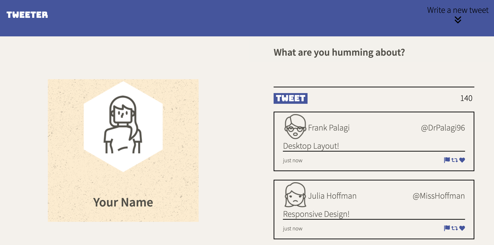
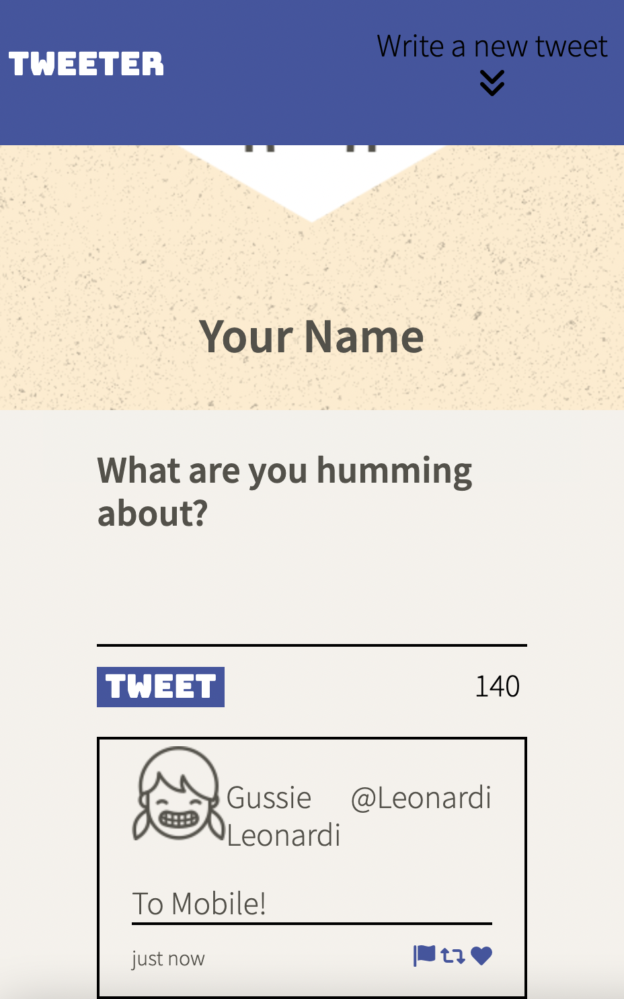
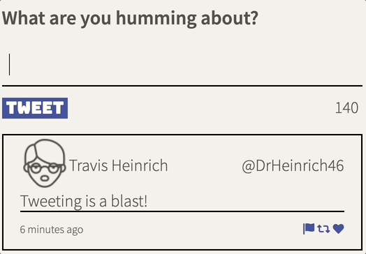
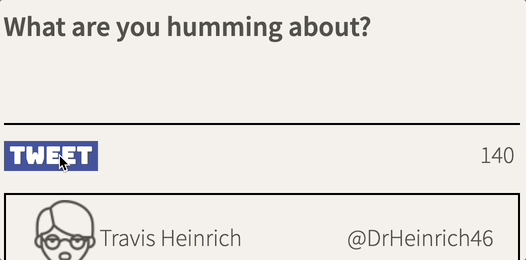
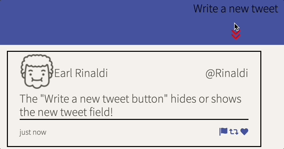
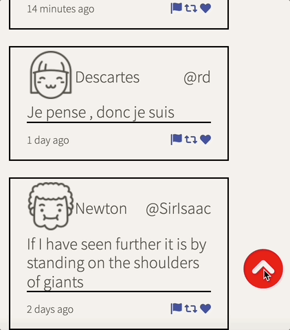

# Tweeter Project

Tweeter is a simple, single-page Twitter clone.

This project demonstrates implementation of HTML, CSS, JS, jQuery and AJAX front-end skills, and Node, Express back-end skills.

## Final Product

Tweeter is responsive, and provides dynamic desktop and mobile layouts.
 

### New Tweets

New tweets can be entered in the text field, submitted using the "Tweet" Button, and are instantly uploaded to the tweet timeline.

The character counter in the bottom right updates in real time with input, and resets when a tweet is submitted.

### Input Errors

When users attempt to enter a blank tweet, or a tweet that is greater than 140 characters, they will be presented with an appropriate, persistent error message.

### Additional Features

Tweeter comes with two additional features - the "Write a New Tweet" Button, and a "Scroll-to-Top" Arrow Button.

The "Write a New Tweet" Button hides or shows the new tweet text input field.

The "Scroll-to-Top" Arrow Button will only appear when there are many tweets on the timeline, and the top is no longer visible. This button instantly brings the user to the top of the page, and centers them on starting a new tweet.

## Getting Started

1. Clone this repository onto your local device.
2. Install all dependencies using the `npm install` command.
3. Start the web server using the `npm run local` command. The app will be served at <http://localhost:8080/>.
4. Go to <http://localhost:8080/> in your browser.

## Dependencies

- Express
- Node 5.10.x or above
- Body Parser
- Chance
- md5